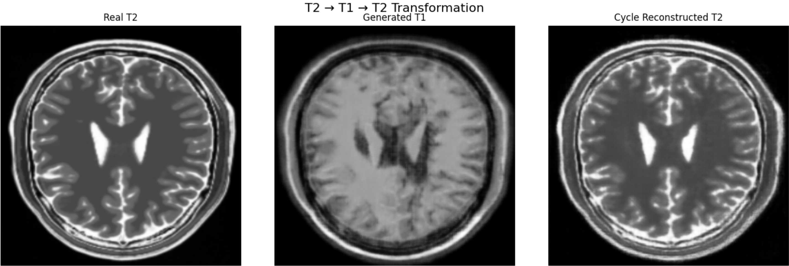
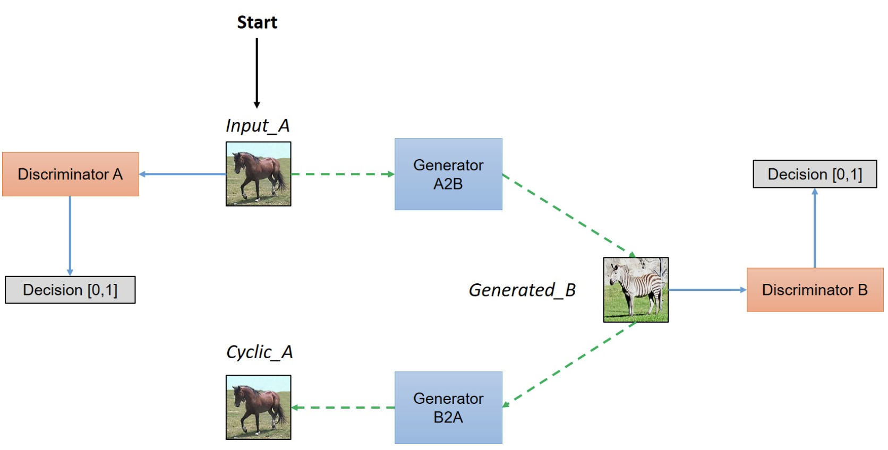
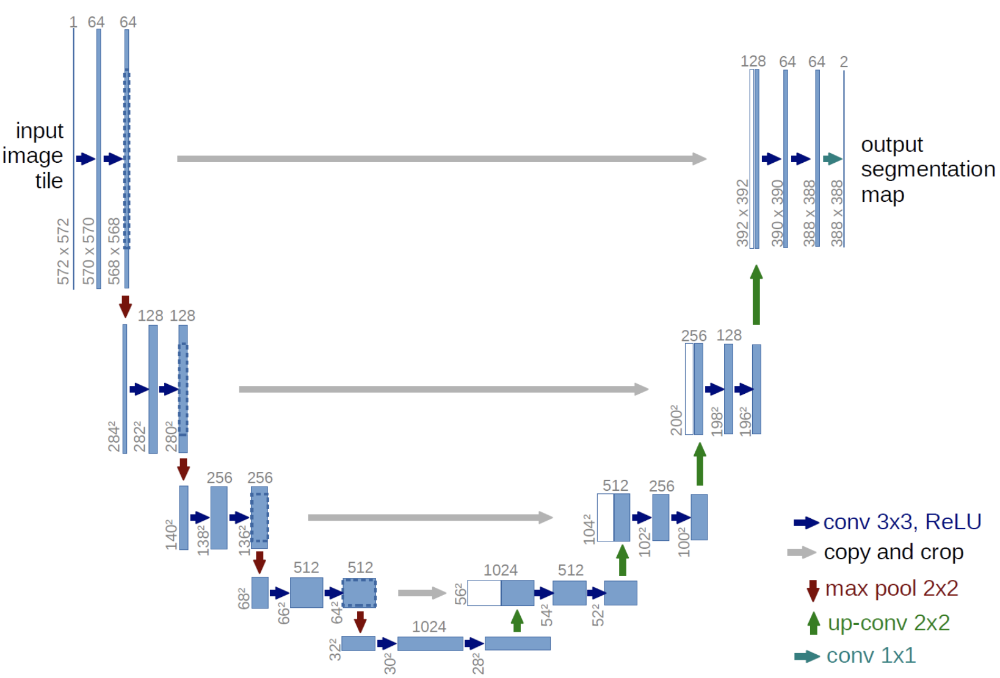
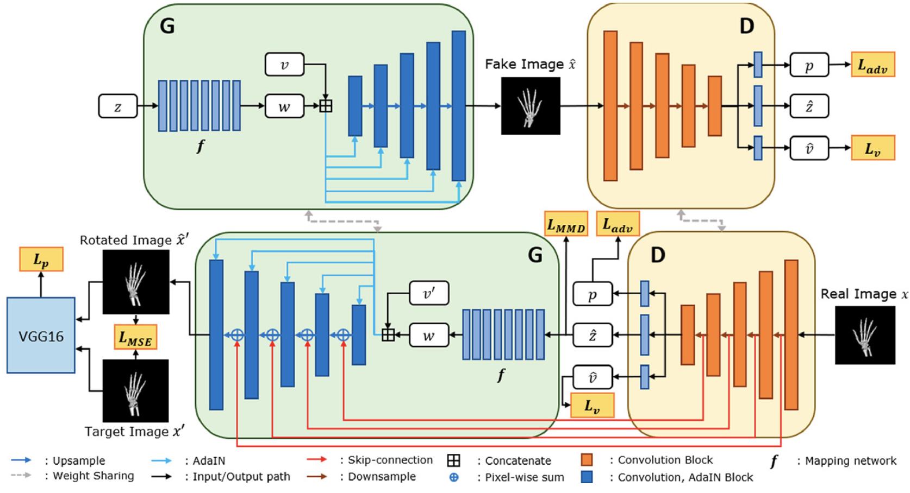

# 🧠 MRI T1-T2 Style Transfer using CycleGAN



**Author:** Ursina Sanderink  
**Technology Stack:** TensorFlow, Python  
**Model Architecture:** CycleGAN with 114+ Million Parameters

---

## 🗂 Overview

This project implements a Cycle-Consistent Generative Adversarial Network (CycleGAN) for **bidirectional transformation** between **T1-weighted** and **T2-weighted** brain MRI scans — *without requiring paired training data*.

The goal: Create a tool that can **generate one MRI contrast from the other** to assist clinicians, reduce patient scan time, and improve access to diagnostic imaging.

---

## 🧠 Problem Statement

MRI scans with different contrasts (T1, T2, etc.) provide complementary information. However, acquiring multiple sequences:

- ⏳ Increases scanning time  
- 💰 Raises costs  
- 😩 Causes patient discomfort  
- 🧭 Is not always feasible in emergencies or low-resource settings

We aim to **synthesize missing contrasts** using unpaired image-to-image translation — specifically T1 ↔ T2 — using deep generative modeling.

---

## 🧬 Model Architecture

This solution is based on the **CycleGAN framework**, which consists of two generators and two discriminators trained jointly in an adversarial and cycle-consistent way.



### 🔁 Core Components

- **Generator G**: T1 → T2 (54.4M parameters)  
- **Generator F**: T2 → T1 (54.4M parameters)  
- **Discriminator X**: Distinguishes real vs fake T1  
- **Discriminator Y**: Distinguishes real vs fake T2  
- **Total Parameters**: 114,344,708

### 🧠 Generator Architecture — U-Net

To preserve spatial anatomy, the generators use a **U-Net-style encoder-decoder** with skip connections. This is essential in medical imaging.



- **8-level deep** encoder/decoder  
- **Instance normalization** for contrast adaptation  
- **Skip connections** preserve structural fidelity

### 🧪 Discriminator — PatchGAN

Discriminators use a **70×70 PatchGAN**, focusing on **local realism** rather than global structure, which speeds up training and generalizes better.

---

## ⚙️ GAN Principles Refresher



- **Generator**: Learns to produce realistic T1/T2 images  
- **Discriminator**: Learns to detect fake images  
- **Adversarial Loss**: Pushes realism  
- **Cycle Consistency Loss**: Enforces anatomical integrity  
- **Identity Loss**: Stabilizes color and contrast

> The model balances these losses to ensure both **realistic output** and **anatomical faithfulness**.

---

## 🏥 Clinical Motivation

- ⏱ **Reduced Scan Times**: Generate missing MRI sequences virtually  
- 😌 **Patient Comfort**: Shorter procedures reduce discomfort and movement  
- 💸 **Cost Efficiency**: Streamlined radiology workflows  
- 🚑 **Emergency Imaging**: Faster decisions with limited sequences  
- 🌍 **Global Health**: Extend diagnostic capabilities in low-resource settings

---

## 🧰 Technical Architecture Summary

### 🔧 Key Features

- 🧠 **U-Net Generators**: Encoder-decoder with skip connections  
- 📦 **PatchGAN Discriminators**  
- 🧼 **Instance Normalization**  
- 🔁 **Cycle Consistency (λ=10.0)**  
- 🆔 **Identity Loss (λ=0.5)**  

---

## 💡 Implementation Highlights

### 🧪 Medical Image Optimizations

- Support for **16-bit grayscale DICOM-style data**  
- Specialized preprocessing to retain voxel-level detail  
- Smart augmentations to simulate real-world variability

---

## ⚙️ Performance

### 💻 Training Specs

- **Hardware**: T4 GPU – 16GB VRAM  
- **Memory Usage**: ~12GB  
- **Batch Size**: 1  
- **Speed**: ~45 sec/epoch  

### ⏱ Training Duration

| Epochs     | Time         | Use Case         |
|------------|--------------|------------------|
| 20         | 15–30 min    | Quick demo       |
| 100        | 2–4 hours    | Good quality     |
| 200        | 6–8 hours    | Production level |

### 🧠 Model Performance

- ⚡ Inference: <1 second/image  
- 📐 Input/Output: 256×256×1 grayscale  
- 🔁 Cycle Recons.: High structural fidelity  
- 🎨 Contrast Transfer: Realistic and accurate

---

## 🔧 Key Hyperparameters

- 📉 Learning Rate: `2e-4`  
- 🧠 Optimizer: Adam (β₁ = 0.5)  
- 🔁 Cycle Loss Weight: 10.0  
- 🆔 Identity Loss Weight: 0.5  
- 🖼 Image Resolution: 256×256

---

## 💡 Technical Innovation

- 🧬 Instance norm customized for medical domains  
- ⚖️ Loss balancing for structure preservation  
- 📈 Interactive monitoring & reproducibility  
- 💾 Lightweight enough for free GPU use

---

## 🧪 Research Contributions

- 🔄 Unpaired medical image translation  
- 🎓 Teaching framework for GAN learners  
- 📚 Reproducible and open-source medical AI research  
- 🧠 Bridging radiology needs with deep learning tools

---

## 📊 Results

### 📏 Quantitative Metrics

- 💾 Model Size: ~450MB (float32)  
- ⚙️ Parameters: 114M  
- 📈 Stable training with consistent convergence

### 👁 Qualitative Assessment

| Category                | Rating            |
|------------------------|-------------------|
| Anatomical Preservation| ⭐️⭐️⭐️⭐️⭐️         |
| Contrast Accuracy      | ⭐️⭐️⭐️⭐️           |
| Artifacts              | Minimal           |
| Cycle Consistency      | High Fidelity     |

---

## 🏥 Clinical Validation

**Status**: 🚧 Research & educational use only

**Future Steps**:

- 🩻 Radiologist evaluation  
- 📊 Diagnostic performance studies  
- 🏥 Workflow integration  
- 🛡 Regulatory clearance

---

## 📦 Dependencies

```python
tensorflow>=2.8.0  
numpy>=1.21.0  
matplotlib>=3.5.0  
opencv-python>=4.5.0  
pillow>=8.3.0  
tqdm>=4.62.0

## 🔖 Citation
If you use this implementation in your research:


@misc{sanderink2025mri_cyclegan,
  title={MRI T1-T2 Style Transfer using CycleGAN},
  author={Ursina Sanderink},
  year={2025},
  howpublished={\url{https://github.com/your-repo/mri-cyclegan}}
}

## 📄 License
MIT License — see LICENSE file for details.

## 🙏 Acknowledgments

🧠 Based on CycleGAN by Zhu et al. (2017)

💡 Inspired by work in medical GAN research

🧪 Designed to teach & explore AI in radiology

🎓 Educational bridge between imaging & deep learning

⚠️ Disclaimer: For research and education only. Not for clinical diagnosis or medical decision-making without regulatory approval.
